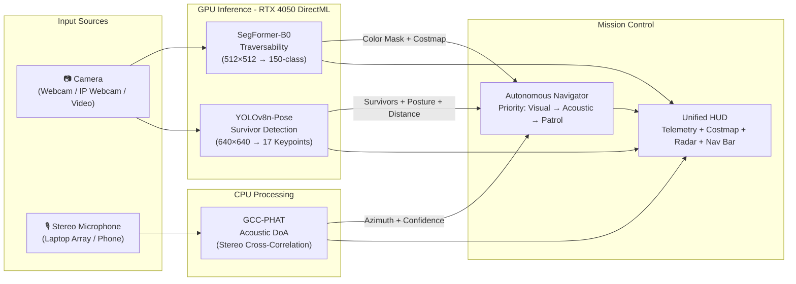

<div align="center">

# 🤖 USAR Autonomous Perception Engine

### Vision-Based Autonomous Navigation for Unmanned Ground Vehicles

**Smart India Hackathon 2026 — Team LARPERS**

[](https://python.org)
[](https://onnxruntime.ai)
[](https://nvidia.com)
[](LICENSE)

*Real-time, GPU-accelerated multi-modal perception for Urban Search & Rescue robotics.*

</div>

---

## 📋 Overview

A unified autonomous perception system that enables an Unmanned Ground Vehicle (UGV) to navigate disaster rubble, detect trapped survivors, and localize distress sounds — all running in real-time on a single NVIDIA GPU.

The system fuses **three perception modalities** through a unified mission control pipeline:

| Modality | Model / Technique | Hardware | Output |
|---|---|---|---|
| 🟩 Terrain Traversability | SegFormer-B0 (ADE20K) | RTX 4050 GPU | 5-class semantic map + Nav2 costmap |
| 🧍 Survivor Detection | YOLOv8n-Pose (COCO) | RTX 4050 GPU | Pose skeleton + posture + distance |
| 🔊 Acoustic Localization | GCC-PHAT (Stereo Mic) | CPU | Voice direction-of-arrival bearing |

---

## 🏗️ Architecture



---

## ✨ Features

### Terrain Traversability (5-Class Semantic Segmentation)
- **🟩 Green** — Traversable ground (floors, roads, sidewalks, grass, dirt)
- **🟦 Cyan** — Stairways and steps (navigation incline corridor)
- **🟥 Red** — Lethal obstacles (walls, furniture, columns, persons)
- **🟧 Orange** — Hazards (water, pits, drop-offs)
- **⬛ Gray** — Background (ceiling, sky)
- Generates a **Nav2-compatible metric costmap** (0 = free, 80 = stairs, 250 = hazard, 254 = lethal)

### Survivor Detection & Pose Estimation
- **High-recall detection** (confidence threshold 0.18) to catch partially occluded victims
- **17 anatomical keypoints** with skeletal bone rendering
- **Posture classification**: `PRONE_FLAT`, `PINNED_UPPER`, `CURLED`, `UPRIGHT`
- **Entrapment severity**: `SEVERELY_TRAPPED`, `PARTIALLY_TRAPPED`, `EXPOSED`
- **Calibrated distance estimation** using shoulder span + bounding box fusion (wide-angle 82° HFOV)

### Acoustic Voice Localization
- **GCC-PHAT** stereo cross-correlation for Direction-of-Arrival
- **Bandpass filter** (300–3400 Hz) to isolate human voice from motor/chassis noise
- Works with **laptop stereo mic array** or **network phone audio** streams
- Real-time tactical acoustic compass HUD

### Autonomous Navigation
- **Priority-based dispatch**: Visual Survivor Lock → Acoustic Homing → Autonomous Patrol
- Computes steering heading, target distance, and recommended speed
- Outputs human-readable mission dispatch commands

---

## 💻 Hardware Requirements

| Component | Minimum | Recommended |
|---|---|---|
| GPU | Any DirectX 12 GPU | NVIDIA RTX 4050+ |
| RAM | 8 GB | 16 GB |
| Microphone | Mono (basic) | Stereo array (for acoustic DoA) |
| Camera | Any USB webcam | Wide-angle (82°+ HFOV) |
| Python | 3.11+ | 3.11.9 |

---

## 🚀 Quick Start

### 1. Clone & Install

```bash
git clone https://github.com/fluffypanda44/SIH-LARPERS-2026-.git
cd SIH-LARPERS-2026-
pip install -r requirements.txt
```

### 2. Download Model Weights

The ONNX model weights are tracked via [Git LFS](https://git-lfs.com/). If they weren't pulled automatically:

```bash
git lfs install
git lfs pull
```

### 3. Run

**Full Mission Control** (all 3 engines + navigation):
```bash
python mission_control.py
```

**Traversability Only:**
```bash
python real_vision.py
```

**Survivor Detection Only:**
```bash
python survivor_detector.py
```

---

## 📱 Usage Examples

```bash
# Webcam (default camera index 0)
python mission_control.py

# Wireless phone camera (IP Webcam app)
python mission_control.py --url http://192.168.1.5:8080

# Pre-recorded video file
python mission_control.py --video disaster_footage.mp4

# Custom webcam index + overlay transparency
python mission_control.py --webcam 1 --alpha 0.40

# Separate audio source from a phone
python mission_control.py --webcam 0 --audio-url http://192.168.1.5:8080
```

---

## 🎮 Keyboard Controls

| Key | Action |
|---|---|
| `t` | Toggle traversability mask overlay |
| `s` | Toggle survivor detection skeletons |
| `r` | Toggle acoustic radar compass |
| `q` | Quit |

---

## 📁 Project Structure

```
SIH-LARPERS-2026-/
├── mission_control.py      # Unified HUD — fuses all 3 engines + autonomous navigator
├── real_vision.py          # SegFormer-B0 traversability perception engine
├── survivor_detector.py    # YOLOv8n-Pose survivor detection & pose estimation
├── acoustic_doa.py         # GCC-PHAT acoustic direction-of-arrival engine
├── actuation_bridge.py     # Closed-loop robotics dispatcher (ROS2 Twist over UDP :9090)
├── camera_utils.py         # Resilient threaded video capture & reconnect handler
├── segformer_b0.onnx       # SegFormer-B0 weights (ADE20K 150-class) [Git LFS]
├── yolov8n-pose.onnx       # YOLOv8n-Pose weights (COCO 17-keypoint) [Git LFS]
├── requirements.txt        # Runtime dependencies
└── .gitignore
```

---

## 🔧 Tech Stack

- **Semantic Segmentation**: [SegFormer-B0](https://huggingface.co/nvidia/segformer-b0-finetuned-ade-512-512) (NVIDIA, ADE20K 150 classes)
- **Pose Estimation**: [YOLOv8n-Pose](https://docs.ultralytics.com/tasks/pose/) (Ultralytics, COCO 17 keypoints)
- **Acoustic DoA**: Generalized Cross-Correlation with Phase Transform (GCC-PHAT)
- **GPU Inference**: [ONNX Runtime](https://onnxruntime.ai/) with DirectML execution provider
- **Computer Vision**: [OpenCV](https://opencv.org/) 5.0
- **Audio Capture**: [sounddevice](https://python-sounddevice.readthedocs.io/) (PortAudio)

---

## 👥 Team LARPERS

<!-- TODO: Add team member names and roles -->
| Name | Role |
|---|---|
| — | — |
| — | — |
| — | — |

---

<div align="center">

**Built for Smart India Hackathon 2026** 🇮🇳

</div>
